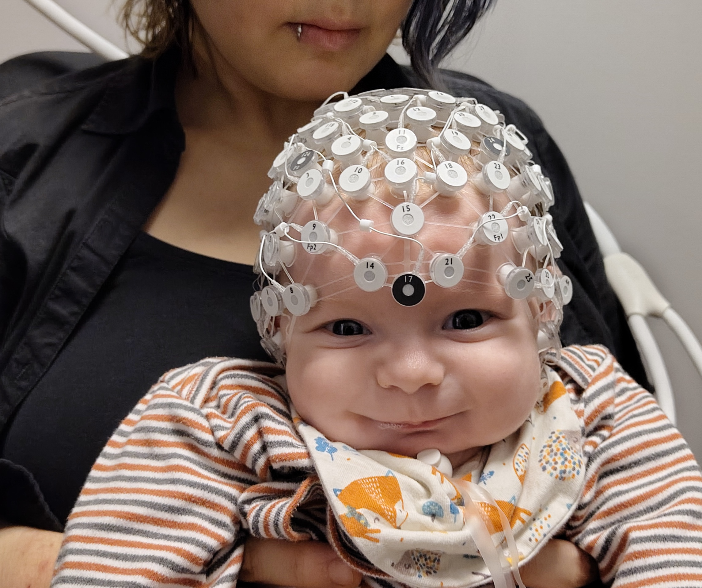

# EEG Analysis

  

Secondary experiment

Add Relax recordings as:

Relax → Low stress

Then compare:

Model A

Low vs High based on subjective score

versus

Model B

Relax vs Stress-task

This comparison would actually be useful in your research.

If Model B gets 95% accuracy but Model A gets 65%, that tells us something important:

EEG easily distinguishes experimental conditions, but predicting the person's actual perceived stress is much harder.

That's scientifically much more interesting than reporting 95% accuracy alone.