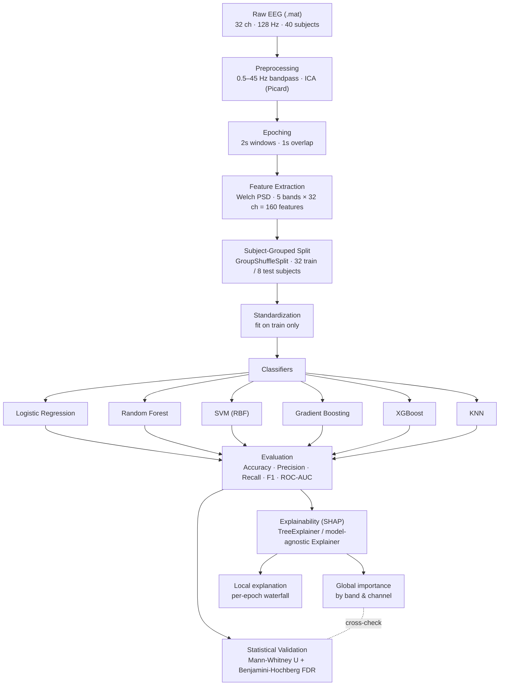

# EEG Stress Detection — Leakage-Free & Explainable (SAM-40)


Subject-independent stress classification from EEG, with SHAP-based explainability and
independent statistical validation. Built on the [SAM-40](https://doi.org/10.1016/j.dib.2021.107772)
dataset (40 subjects, 32-channel EEG, three stress-inducing tasks).

Most published EEG-stress papers evaluate with subject-*dependent* splits, letting epochs
from the same person leak into both train and test — which inflates accuracy. This project
does the opposite on purpose: every split is subject-grouped, so no participant's data ever
appears in both sets, and every model comes with an explanation, not just a score.

<div align="center">
  
</div>

## Content
- [Highlights](#highlights)
- [Pipeline Architecture](#pipeline-architecture)
- [Dataset](#dataset)
- [Feature Extraction](#feature-extraction)
- [Models & Results](#models--results)
- [Explainability (SHAP)](#explainability-shap)
- [Statistical Validation](#statistical-validation)
- [Getting Started](#getting-started)
- [Limitations](#limitations)
- [Citation](#citation)
- [License](#license)

---

## Highlights

- **No subject leakage** — group-based train/test split at the subject level.
- **6 classifiers benchmarked** under the same protocol (Logistic Regression, Random Forest, SVM, Gradient Boosting, XGBoost, KNN).
- **Explainable** — SHAP global + per-prediction explanations, aggregated by frequency band and by channel.
- **Statistically validated** — SHAP findings cross-checked with non-parametric hypothesis tests (Mann–Whitney U, FDR-corrected).
- **Honest benchmarking** — results compared directly against other leakage-free (LOSO) SAM-40 baselines, not against inflated subject-dependent numbers.

---

## Pipeline Architecture



---

## Dataset

| | |
|---|---|
| Source | [SAM-40](https://doi.org/10.1016/j.dib.2021.107772) |
| Subjects | 40 |
| Channels | 32 (10-20 system) |
| Sampling rate | 128 Hz |
| Tasks | Stroop color-word test, mental arithmetic, mirror-image recognition, relaxation |
| Label | Self-reported stress rating (0–10) per trial |
| Epoching | 2s windows, 1s overlap → 11,520 epochs total |

**Target:** binary — `stress_level ≥ 4` → *stressed* (1), else *not stressed* (0).

---

## Feature Extraction

Per epoch, per channel, average power (Welch's method) is computed in five canonical bands:

| Band | Range (Hz) |
|---|---|
| Delta | 1–4 |
| Theta | 4–8 |
| Alpha | 8–13 |
| Beta | 13–30 |
| Gamma | 30–45 |

→ **32 channels × 5 bands = 160 features per epoch.**

---

## Models & Results

Evaluated on a held-out set of **8 subjects** (2,304 epochs), never seen during training.

| Model | Accuracy | Precision | Recall | F1 | ROC-AUC |
|---|---|---|---|---|---|
| **Logistic Regression** | **0.571** | **0.611** | 0.652 | **0.631** | **0.595** |
| XGBoost | 0.558 | 0.610 | 0.592 | 0.601 | 0.584 |
| Gradient Boosting | 0.559 | 0.604 | 0.627 | 0.616 | 0.584 |
| Random Forest | 0.539 | 0.601 | 0.533 | 0.565 | 0.556 |
| KNN | 0.549 | 0.589 | **0.656** | 0.621 | 0.550 |
| SVM (RBF) | 0.544 | 0.586 | 0.645 | 0.614 | 0.531 |

Precision/Recall/F1 are for the positive ("stressed") class.

> **Why is 57% good here?** Under a *subject-independent* protocol, this is in line with (and slightly above) the only comparable leakage-free SAM-40 benchmark we found — a 40-fold LOSO Random Forest at 58.7% accuracy. Many papers reporting 90%+ on this dataset do not enforce subject-independent splits.

---

## Explainability (SHAP)

- **By frequency band:** Gamma > Beta > Theta > Alpha > Delta (summed mean |SHAP value|).
- **By channel:** EEG004, EEG018, EEG025, EEG003, EEG024 rank highest.
- **Top single feature:** `EEG004_theta`.

Both global (beeswarm, bar) and local (waterfall) explanations are generated for the
best-performing model.

## Statistical Validation

SHAP rankings are cross-checked independently, not taken at face value:

- **Band level:** Mann–Whitney U test, all 5 bands significant (p < 0.01), effect sizes (Cohen's d) small (|d| ≤ 0.21) — the signal is real but subtle.
- **Feature level:** 117 / 160 channel×band features remain significant after Benjamini–Hochberg FDR correction (α = 0.05).

---

## Getting Started

```bash
git clone <this-repo>
cd <this-repo>
pip install -r requirements.txt   # mne, scikit-learn, xgboost, shap, statsmodels, scipy
jupyter notebook preprocessing.ipynb   # raw → epoched EEG
jupyter notebook stress.ipynb          # features → models → SHAP → stats
```

Raw SAM-40 `.mat` files are **not included** — download them from the
[official source](https://doi.org/10.1016/j.dib.2021.107772) and place them under `Data/raw_data/`.

---

## Limitations

- Single subject-grouped 80/20 hold-out, not full 40-fold LOSO (higher variance on the 8-subject test set).
- Spectral band power only — no Hjorth parameters, entropy, or connectivity features yet.
- Binary threshold (`stress_level ≥ 4`) is a common but somewhat arbitrary convention.

## Citation

If you use this work, please cite the SAM-40 dataset paper and reference this repository.

## License

Add a license (e.g. MIT) before publishing.
